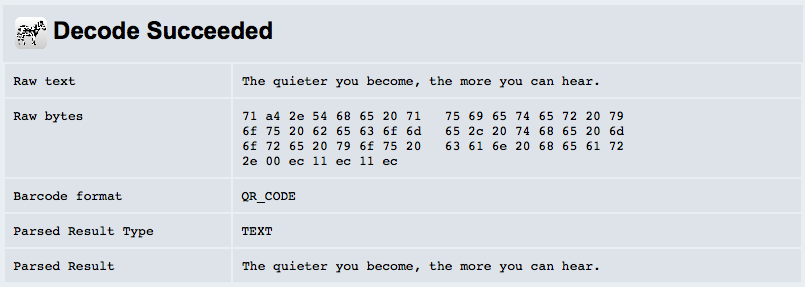

# Java QRCode Generator

Java Tools for generating QRCode.


## Prerequires

1. Git 2.6+
2. Maven 3.3+
3. Java 8+


## How to Play

Clone

```
git clone https://github.com/humbertodias/java-qrcode.git
```

Inside the folder

```
cd java-qrcode
```

Running

**Writing QRCode**

```
mvn compile \
exec:java \
-Dexec.mainClass="QRCode"  \
-Dexec.args="doc/qrcode.png 256 256 'The quieter you become, the more you can hear.'"
```

**Arguments**

Index | Value  | Description
------------- | ------------- | -------------
0 | doc/qrcode.png | File path
1 | 256 | Width Image 
2 | 256 | Height Image
3 | 'The quieter you become, the more you can hear.' | Message

## Output


**Reading QRCode**

```
mvn compile \
exec:java \
-Dexec.mainClass="QRCode"  \
-Dexec.args="doc/qrcode.png"
```

Arguments

Index | Value  | Description
------------- | ------------- | -------------
0 | doc/qrcode.png | File path


```
[INFO] --- exec-maven-plugin:1.4.0:java (default-cli) @ java-qrcode ---
The quieter you become, the more you can hear.
[INFO] ------------------------------------------------------------------------
[INFO] BUILD SUCCESS
[INFO] ------------------------------------------------------------------------
[INFO] Total time: 1.832 s
[INFO] Finished at: 2016-06-14T00:57:53-03:00
[INFO] Final Memory: 11M/245M
[INFO] ------------------------------------------------------------------------
```

## Validate

[https://zxing.org/w/decode.jspx](https://zxing.org/w/decode.jspx)




## References

1. [QRCode](https://en.wikipedia.org/wiki/QR_code)
